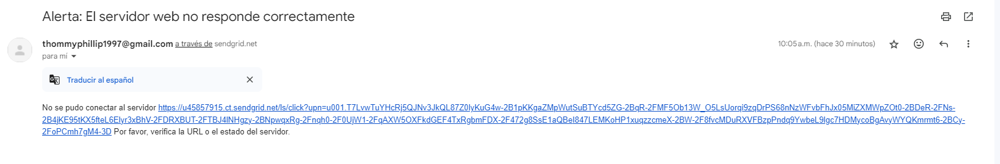

# Script en Python para verificar el estado de un servidor Web
Se creó un script en Python para realizar la verificación el estado de un servidor a través de una solicitud HTTP. Decidí utilizar Python ya que domino mejor este lenguaje, además que mas adelante se puede utilizar este script para funciones mas complejas que no s epuedan realizar con Bash, además el uso de las librerías ayuda a facilitar el trabajo.
## Funcionamiento del Script
### Requisitos
Se debe tener instalado **Python** en la máquina, además de instalar la biblioteca **request**, ya que esta es la que realiza las solicitudes HTTP. Tambien se debe tener una cuenta en **SendGrid** para el uso de su API para enviar correos electrónicos.
### Explicación del Script
### Librerias
`import requests` Biblioteca para realizar solicitudes HTTP de manera sencilla.
`import json` Biblioteca para manejar datos en formato JSON.
### Configuración de variables
`url_del_servidor` 
`codigo_estado_esperado`
`clave_api_sendgrid`
`correo_destinatario` 
`correo_remitente` 
`asunto_correo` 
`cuerpo_correo` 
.Se utilizaron las anteriores variables en el script para autenticarse y realizar el envío de correos con su asunto y cuerpo.
### Función para enviar correo electrónico
`def enviar_correo(asunto, cuerpo)`
Se utilizó esta funcion para enviar un correo electrónico usando la API de SendGrid, además del uso de la libreria **JSON** para la estructura de `datos_correo`. con `requests.post` para enviar una solicitud POST a la API de SendGrid para enviar el correo.
### Comprobación del estado del servidor
**El Bloque try**
`respuesta_servidor = requests.get(url_del_servidor)` Realiza una solicitud HTTP GET a la URL del servidor.
`codigo_estado_servidor = respuesta_servidor.status_code` Obtiene el código de estado HTTP de la respuesta e imprime el código de estado del servidor.
Si el código de estado no coincide con el esperado `(codigo_estado_esperado)`, llama a `enviar_correo` para notificar el problema.
### Resultados
Se hizo una solicitud al servidor `https://www.exampless.com/` el cual no responde. Sejecutó el Script y se obtuvo el resultado esperado.
Comprobación de envío en SendGrid
}

